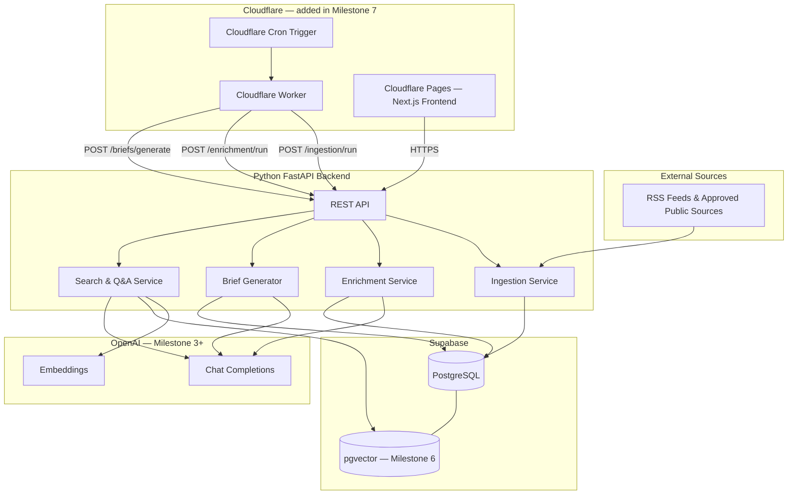
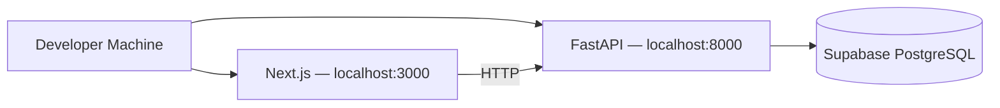

# TMJ Editorial Intelligence Engine — Version 1 Implementation Plan

This document defines the architecture, data model, API surface, and build milestones for **Version 1 only**, as scoped in [PROJECT_BRIEF.md](./PROJECT_BRIEF.md).

Development starts **locally** with a minimal starter stack. Cloudflare hosting, cron jobs, and Workers are added only after RSS ingestion works on a developer machine.

---

## System Architecture

Version 1 is an internal newsroom platform with three logical layers: ingestion, AI enrichment, and a read-focused frontend for briefs, articles, and semantic Q&A. The full target architecture includes Cloudflare scheduling; that is introduced in a **later deployment milestone**, not at project start.

### Target architecture (Version 1 complete)



### Local development architecture (Milestones 1–6)

During local development, the frontend and backend run on the developer machine. The database is a hosted Supabase project. Pipeline steps are triggered manually (API calls or a simple script), not by cron.



### Component responsibilities

| Layer | Technology | When introduced | Role |
|---|---|---|---|
| Frontend | Next.js + TypeScript | Milestone 1 (homepage); Milestone 5 (full UI) | Display daily brief, articles, sources, search and Q&A |
| API | Python FastAPI | Milestone 1 | Business logic and REST endpoints |
| Database | Supabase PostgreSQL | Milestone 1 | Persistent storage; pgvector added in Milestone 6 |
| AI | OpenAI API | Milestone 3 | Summaries, sentiment, themes, scoring, brief narrative, Q&A |
| Ingestion | feedparser + httpx (backend) | Milestone 2 | Fetch and parse public RSS/Atom feeds only |
| Scheduler | Cloudflare Cron Trigger + Worker | Milestone 7 | Fire daily pipeline steps in production |
| Hosting | Cloudflare Pages + Workers | Milestone 7 | Deploy frontend and cron orchestration |

### Daily pipeline flow (production — Milestone 7)

Intended daily brief delivery time: **07:00 AM Asia/Qatar** (`Asia/Qatar`, UTC+3, no DST).

Equivalent UTC cron: **`0 4 * * *`** (04:00 UTC).

1. **07:00 Asia/Qatar** — Cron Worker calls `POST /api/v1/ingestion/run`.
2. Ingestion fetches all active sources, deduplicates by URL, stores raw + extracted text.
3. Worker calls `POST /api/v1/enrichment/run` for unprocessed articles.
4. Enrichment generates AI fields, assigns themes, computes editorial score.
5. Worker calls `POST /api/v1/briefs/generate` for today's date (Asia/Qatar calendar day).
6. Brief generator ranks top articles and assembles the five editorial questions.
7. Embeddings are generated during enrichment (Milestone 6); search is available on demand.
8. Editors access the brief and search/Q&A via the deployed Next.js frontend.

Locally (Milestones 2–6), run the same steps manually in order until Cloudflare automation is wired up.

### Design principles

- **Start simple, grow in place**: Milestone 1 is deliberately minimal; later milestones add tables, services, and pages via migrations.
- **Clean architecture**: routes → services → repositories; no direct DB access from route handlers.
- **Idempotent jobs**: ingestion and enrichment safe to re-run; URL uniqueness prevents duplicates.
- **Fail gracefully**: per-source and per-article errors logged; pipeline continues.
- **Citation-first Q&A**: answers must reference stored article IDs and URLs; no unsourced claims.
- **Compliance**: only approved public RSS/API sources; no login, cookies, CAPTCHA bypass, or headless-browser scraping.

---

## Folder Structure

Structure grows by milestone. Files marked *(later)* are not created until the milestone noted.

```
tmj-editorial-intelligence/
├── PROJECT_BRIEF.md
├── IMPLEMENTATION_PLAN.md
├── README.md
├── .env.example
├── .gitignore
│
├── supabase/
│   └── migrations/
│       ├── 001_initial_schema.sql          # M1: sources, articles, ingestion_runs
│       ├── 002_seed_source.sql             # M1: one RSS source
│       ├── 003_enrichment_schema.sql       # M3: AI columns, themes, tags
│       ├── 004_briefs_schema.sql           # M4: editorial_briefs
│       └── 005_pgvector_and_search.sql     # M6: embeddings, search_queries
│
├── backend/
│   ├── pyproject.toml
│   ├── requirements.txt
│   ├── app/
│   │   ├── main.py
│   │   ├── core/
│   │   │   ├── config.py
│   │   │   └── logging.py                  # M1
│   │   │   ├── security.py                 # M2 — API key for pipeline routes
│   │   │   └── exceptions.py               # M2
│   │   ├── api/
│   │   │   ├── deps.py
│   │   │   └── routes/
│   │   │       ├── health.py               # M1
│   │   │       ├── sources.py              # M2
│   │   │       ├── articles.py             # M2
│   │   │       ├── ingestion.py            # M2
│   │   │       ├── enrichment.py           # M3
│   │   │       ├── briefs.py               # M4
│   │   │       ├── search.py               # M6
│   │   │       └── themes.py               # M3
│   │   ├── schemas/
│   │   ├── db/
│   │   │   ├── client.py
│   │   │   └── repositories/
│   │   └── services/
│   │       ├── ingestion/                  # M2
│   │       ├── enrichment/                 # M3
│   │       ├── brief/                      # M4
│   │       └── search/                     # M6
│   └── tests/                              # M2+ — focused tests per feature; no full suite in M1
│
├── frontend/
│   ├── package.json
│   ├── next.config.ts
│   ├── tsconfig.json
│   ├── app/
│   │   ├── layout.tsx                      # M1
│   │   ├── page.tsx                        # M1 — homepage
│   │   ├── brief/[date]/page.tsx           # M5
│   │   ├── articles/                       # M5
│   │   ├── sources/page.tsx                # M5
│   │   └── search/page.tsx                 # M6
│   ├── components/                         # M5–M6
│   └── lib/
│       ├── api.ts                          # M5
│       └── types.ts
│
└── workers/                                # M7 — Cloudflare Worker + cron
    ├── wrangler.toml
    ├── package.json
    └── src/
        └── cron.ts
```

---

## Database Tables

All tables live in Supabase PostgreSQL. UUIDs are used for primary keys. Timestamps are `timestamptz` (UTC).

Tables are introduced in phases. Only the three **initial tables** exist after Milestone 1.

### Initial tables (Milestone 1)

#### `sources`

Approved RSS/public feed sources.

| Column | Type | Notes |
|---|---|---|
| `id` | `uuid` PK | `gen_random_uuid()` |
| `name` | `text` NOT NULL | Human-readable label |
| `feed_url` | `text` NOT NULL UNIQUE | Public RSS/Atom URL |
| `publisher` | `text` | Outlet name |
| `region` | `text` | e.g. `kerala`, `india`, `diaspora`, `international` |
| `language` | `text` DEFAULT `'en'` | ISO 639-1 code |
| `is_active` | `boolean` DEFAULT `true` | Skip when false |
| `last_fetched_at` | `timestamptz` | |
| `last_error` | `text` | Last fetch failure message |
| `created_at` | `timestamptz` DEFAULT `now()` | |
| `updated_at` | `timestamptz` DEFAULT `now()` | |

**Milestone 1 seed**: one active public RSS source (e.g. a major Kerala or India news outlet feed), inserted via `002_seed_source.sql`.

#### `articles`

Core content store. Milestone 1 includes ingestion fields only; AI and enrichment columns are added in Milestone 3.

| Column | Type | Milestone | Notes |
|---|---|---|---|
| `id` | `uuid` PK | 1 | |
| `source_id` | `uuid` FK → `sources.id` | 1 | |
| `title` | `text` NOT NULL | 1 | |
| `url` | `text` NOT NULL UNIQUE | 1 | Dedup key |
| `author` | `text` | 1 | |
| `published_at` | `timestamptz` | 1 | From feed |
| `fetched_at` | `timestamptz` NOT NULL | 1 | |
| `extracted_text` | `text` NOT NULL | 1 | Clean plain text |
| `word_count` | `int` | 1 | |
| `created_at` | `timestamptz` DEFAULT `now()` | 1 | |
| `updated_at` | `timestamptz` DEFAULT `now()` | 1 | |
| `raw_html` | `text` | 2 | Optional; truncated if large |
| `processing_status` | `text` DEFAULT `'pending'` | 3 | `pending`, `processing`, `completed`, `failed` |
| `processing_error` | `text` | 3 | |
| `summary` | `text` | 3 | AI-generated |
| `sentiment` | `text` | 3 | e.g. `positive`, `negative`, `neutral`, `mixed` |
| `sentiment_score` | `numeric(4,3)` | 3 | -1.0 to 1.0 |
| `emotional_signals` | `jsonb` | 3 | |
| `stakeholder_stance` | `jsonb` | 3 | |
| `suggested_story_formats` | `jsonb` | 3 | |
| `kerala_relevance` | `text` | 3 | Why it matters to Kerala/TMJ audiences |
| `editorial_score` | `numeric(5,2)` | 3 | 0–100 priority score |
| `coverage_recommendation` | `text` | 3 | `today`, `this_week`, `monitor`, `skip` |
| `embedding` | `vector(1536)` | 6 | OpenAI embedding; pgvector index |

**Milestone 1 indexes**: `url` (unique), `published_at DESC`, `source_id`.

#### `ingestion_runs`

Audit log for each ingestion execution.

| Column | Type | Notes |
|---|---|---|
| `id` | `uuid` PK | |
| `started_at` | `timestamptz` NOT NULL | |
| `completed_at` | `timestamptz` | |
| `status` | `text` NOT NULL | `running`, `completed`, `failed`, `partial` |
| `sources_attempted` | `int` DEFAULT `0` | |
| `sources_succeeded` | `int` DEFAULT `0` | |
| `articles_fetched` | `int` DEFAULT `0` | |
| `articles_new` | `int` DEFAULT `0` | |
| `error_summary` | `jsonb` | Per-source error details |
| `triggered_by` | `text` | `manual` in local dev; `cron` after Milestone 7 |

---

### Additional tables (Milestone 3+)

Added via later migrations once local ingestion is working.

#### `editorial_themes` *(Milestone 3)*

| Column | Type | Notes |
|---|---|---|
| `id` | `uuid` PK | |
| `slug` | `text` NOT NULL UNIQUE | e.g. `kerala-politics` |
| `name` | `text` NOT NULL | Display name |
| `description` | `text` | Used in AI classification prompts |
| `sort_order` | `int` DEFAULT `0` | |
| `is_active` | `boolean` DEFAULT `true` | |

**Seed themes (v1)**:

| Slug | Name |
|---|---|
| `kerala-politics` | Kerala Politics & Governance |
| `kerala-economy` | Kerala Economy & Business |
| `diaspora` | Malayali Diaspora |
| `culture-society` | Culture, Society & Lifestyle |
| `environment-climate` | Environment & Climate |
| `education-health` | Education & Health |
| `national-impact` | National Events Affecting Kerala |
| `technology-innovation` | Technology & Innovation |
| `sports-entertainment` | Sports & Entertainment |

#### `article_themes` *(Milestone 3)*

| Column | Type | Notes |
|---|---|---|
| `article_id` | `uuid` FK → `articles.id` | |
| `theme_id` | `uuid` FK → `editorial_themes.id` | |
| `confidence` | `numeric(4,3)` | 0–1 |
| PRIMARY KEY | `(article_id, theme_id)` | |

#### `article_tags` *(Milestone 3)*

| Column | Type | Notes |
|---|---|---|
| `id` | `uuid` PK | |
| `article_id` | `uuid` FK → `articles.id` | |
| `tag` | `text` NOT NULL | Lowercase normalized |
| UNIQUE | `(article_id, tag)` | |

#### `editorial_briefs` *(Milestone 4)*

One brief per calendar day (Asia/Qatar timezone).

| Column | Type | Notes |
|---|---|---|
| `id` | `uuid` PK | |
| `brief_date` | `date` NOT NULL UNIQUE | Calendar date in `Asia/Qatar` |
| `generated_at` | `timestamptz` NOT NULL | |
| `status` | `text` DEFAULT `'draft'` | `draft`, `published` |
| `headline` | `text` | Brief title |
| `executive_summary` | `text` | Top-level narrative |
| `sections` | `jsonb` NOT NULL | Structured answers to the five editorial questions |
| `ranked_article_ids` | `uuid[]` | Ordered list of article IDs |
| `metadata` | `jsonb` | Article count, themes covered, generation model/version |
| `created_at` | `timestamptz` DEFAULT `now()` | |

**`sections` JSON shape**:

```json
{
  "what_happened": [{ "article_id": "...", "summary": "..." }],
  "why_it_matters": [{ "article_id": "...", "relevance": "..." }],
  "sentiment_landscape": { "dominant_sentiment": "...", "narrative": "..." },
  "tmj_angle": [{ "article_id": "...", "angle": "..." }],
  "coverage_recommendations": [{ "article_id": "...", "recommendation": "today", "rationale": "..." }]
}
```

#### `search_queries` *(Milestone 6)*

| Column | Type | Notes |
|---|---|---|
| `id` | `uuid` PK | |
| `query_text` | `text` NOT NULL | |
| `query_type` | `text` NOT NULL | `semantic`, `qa` |
| `response_text` | `text` | |
| `cited_article_ids` | `uuid[]` | |
| `latency_ms` | `int` | |
| `created_at` | `timestamptz` DEFAULT `now()` | |

---

## API Endpoints

Base path for versioned routes: `/api/v1`. Endpoints are introduced incrementally by milestone.

Authentication *(Milestone 2+)*: pipeline routes require `X-API-Key` header matching `API_SECRET_KEY`. Read routes remain open for local/newsroom use in v1.

### Milestone 1

| Method | Path | Description |
|---|---|---|
| `GET` | `/health` | Liveness check; confirms API is running and can reach Supabase |

### Milestone 2

| Method | Path | Description |
|---|---|---|
| `GET` | `/api/v1/sources` | List sources (`?active=true`) |
| `POST` | `/api/v1/sources` | Add a source |
| `GET` | `/api/v1/sources/{id}` | Get source detail |
| `PATCH` | `/api/v1/sources/{id}` | Update source |
| `DELETE` | `/api/v1/sources/{id}` | Soft-delete (set `is_active=false`) |
| `GET` | `/api/v1/articles` | Paginated list; filters: `date_from`, `date_to`, `source_id` |
| `GET` | `/api/v1/articles/{id}` | Article detail (ingestion fields only) |
| `POST` | `/api/v1/ingestion/run` | Start ingestion run (API key required) |
| `GET` | `/api/v1/ingestion/runs` | List recent runs |
| `GET` | `/api/v1/ingestion/runs/{id}` | Run detail with errors |

### Milestone 3

| Method | Path | Description |
|---|---|---|
| `POST` | `/api/v1/enrichment/run` | Process pending articles (API key required); body: `{ "limit": 50 }` |
| `GET` | `/api/v1/enrichment/status` | Counts by `processing_status` |
| `POST` | `/api/v1/articles/{id}/reprocess` | Re-queue for enrichment (API key required) |
| `GET` | `/api/v1/themes` | List active editorial themes |
| `GET` | `/api/v1/articles` | Extended filters: `theme`, `min_score`, `status` |

### Milestone 4

| Method | Path | Description |
|---|---|---|
| `GET` | `/api/v1/briefs` | List briefs (paginated) |
| `GET` | `/api/v1/briefs/today` | Today's brief (Asia/Qatar) |
| `GET` | `/api/v1/briefs/{date}` | Brief for `YYYY-MM-DD` |
| `POST` | `/api/v1/briefs/generate` | Generate brief for date (API key required); body: `{ "date": "2026-07-07" }` |

### Milestone 6

| Method | Path | Description |
|---|---|---|
| `POST` | `/api/v1/search/semantic` | Body: `{ "query": "...", "limit": 10 }` → ranked articles with snippets |
| `POST` | `/api/v1/search/ask` | Body: `{ "question": "..." }` → answer + `citations[]` with `article_id`, `title`, `url`, `excerpt` |

---

## Environment Variables

Document all variables in `.env.example` at the repository root. Never commit real secrets.

Variables are grouped by when they are first needed.

### Milestone 1 — local starter

**Backend (`backend/.env`)**

| Variable | Required | Description |
|---|---|---|
| `ENVIRONMENT` | Yes | `development` |
| `LOG_LEVEL` | No | Default `INFO` |
| `DATABASE_URL` | Yes | Supabase Postgres connection string |
| `SUPABASE_URL` | Yes | Supabase project URL |
| `SUPABASE_SERVICE_ROLE_KEY` | Yes | Server-side DB access |
| `CORS_ORIGINS` | Yes | Default `http://localhost:3000` |

**Frontend (`frontend/.env.local`)**

| Variable | Required | Description |
|---|---|---|
| `NEXT_PUBLIC_API_URL` | Yes | Default `http://localhost:8000` |

### Milestone 2 — ingestion

| Variable | Required | Description |
|---|---|---|
| `API_SECRET_KEY` | Yes | Shared secret for pipeline endpoints |
| `INGESTION_MAX_ARTICLES_PER_SOURCE` | No | Default `50` |

### Milestone 3 — AI enrichment

| Variable | Required | Description |
|---|---|---|
| `OPENAI_API_KEY` | Yes | OpenAI API key |
| `OPENAI_CHAT_MODEL` | No | Default `gpt-4o-mini` |
| `ENRICHMENT_BATCH_SIZE` | No | Default `20` |

### Milestone 4 — briefs

| Variable | Required | Description |
|---|---|---|
| `BRIEF_TOP_N_ARTICLES` | No | Default `15` |
| `BRIEF_TIMEZONE` | No | Default `Asia/Qatar` |

### Milestone 6 — semantic search

| Variable | Required | Description |
|---|---|---|
| `OPENAI_EMBEDDING_MODEL` | No | Default `text-embedding-3-small` |

### Milestone 7 — Cloudflare deployment

**Worker (Wrangler secrets)**

| Variable | Required | Description |
|---|---|---|
| `API_BASE_URL` | Yes | Deployed FastAPI URL |
| `API_SECRET_KEY` | Yes | Same value as backend |
| `CRON_SCHEDULE` | No | Default `0 4 * * *` (07:00 Asia/Qatar) |

**Frontend (production)**

| Variable | Required | Description |
|---|---|---|
| `NEXT_PUBLIC_API_URL` | Yes | Deployed FastAPI URL |
| `NEXT_PUBLIC_APP_ENV` | No | `production` |

**Backend (production)**

| Variable | Required | Description |
|---|---|---|
| `CORS_ORIGINS` | Yes | Cloudflare Pages URL |
| `ENVIRONMENT` | Yes | `production` |

### Supabase (project dashboard)

| Setting | When | Notes |
|---|---|---|
| Postgres connection string | M1 | Used as `DATABASE_URL` |
| pgvector extension | M6 | Enable before embeddings migration |
| `SUPABASE_ANON_KEY` | Future | For RLS; not used in v1 |

---

## Milestones (Build Order)

Seven milestones. Complete and test each before starting the next. Milestone 1 is intentionally small and beginner-friendly.

---

### Milestone 1 — Local Development Starter

**Goal**: Two runnable apps on your machine, connected to Supabase, proving the stack works end-to-end before any ingestion or AI logic.

**Deliverables**:

- `backend/` — minimal FastAPI app (`main.py`, `config.py`, basic logging)
- `frontend/` — minimal Next.js + TypeScript app (`layout.tsx`, `page.tsx`)
- `.env.example`, `.gitignore`, `README.md` with step-by-step local setup (install deps, copy env files, run both apps)
- `backend/.env` and `frontend/.env.local` documented via `.env.example` (not committed)
- Supabase connection from backend using `DATABASE_URL`
- SQL migration `001_initial_schema.sql` — **only** `sources`, `articles`, `ingestion_runs`
- SQL migration `002_seed_source.sql` — **one** manually seeded active RSS source
- `GET /health` — returns API status and whether Supabase is reachable
- Homepage at `/` titled **"TMJ Editorial Intelligence"** with a short subtitle and a link or note pointing to the backend health check

**Explicitly out of scope for Milestone 1**:

- OpenAI, pgvector, embeddings, semantic search
- Cloudflare Workers, cron jobs, Cloudflare Pages deployment
- RSS fetching, ingestion pipeline, enrichment, briefs
- Advanced frontend pages (brief, articles, sources, search)
- Authentication
- Full test suites (manual smoke checks only)

**What must be tested**:

- [ ] `uvicorn` starts the backend on `localhost:8000` without errors
- [ ] `npm run dev` starts the frontend on `localhost:3000` without errors
- [ ] Homepage displays the title "TMJ Editorial Intelligence"
- [ ] `GET /health` returns 200 with Supabase connected
- [ ] `GET /health` returns a clear error status when `DATABASE_URL` is wrong or missing
- [ ] Migrations apply cleanly; three tables exist in Supabase Table Editor
- [ ] One seeded row appears in `sources`
- [ ] Environment files are gitignored; `.env.example` lists required variables

---

### Milestone 2 — Local RSS Ingestion Pipeline

**Goal**: Fetch articles from the seeded (and any added) public RSS feeds into `articles`, with deduplication and run auditing — all triggered locally.

**Deliverables**:

- Ingestion services: HTTP fetcher (timeout, retry, User-Agent), RSS parser, HTML-to-text extractor
- `sources` CRUD API routes
- `POST /api/v1/ingestion/run` orchestrator writing to `ingestion_runs`
- Per-source error isolation; URL-based deduplication
- `GET /api/v1/ingestion/runs`, run detail, `GET /api/v1/articles`, `GET /api/v1/articles/{id}`
- `API_SECRET_KEY` protection on ingestion trigger
- Migration adding `raw_html` to `articles` if not present in M1
- Focused unit tests for RSS parser and text extractor with fixture files

**What must be tested**:

- [ ] Manual `POST /api/v1/ingestion/run` fetches articles from the seeded RSS source
- [ ] New rows appear in `articles` with title, url, `published_at`, and non-empty `extracted_text`
- [ ] Duplicate URLs are not re-inserted on a second run
- [ ] `ingestion_runs` records status, counts, and any per-source errors
- [ ] Deactivating a source excludes it from the next run
- [ ] Ingestion endpoint rejects requests without valid `X-API-Key`
- [ ] No login, cookie, or headless-browser code paths exist

---

### Milestone 3 — AI Enrichment & Editorial Scoring

**Goal**: Transform ingested articles into enriched, scored, themed records.

**Deliverables**:

- Migration `003_enrichment_schema.sql` — AI columns on `articles`, plus `editorial_themes`, `article_themes`, `article_tags`
- Seed nine editorial themes
- OpenAI client wrapper with retry and rate-limit handling
- Enrichment pipeline: summary, sentiment, emotional signals, stakeholder stance, story formats, Kerala relevance, coverage recommendation
- Theme classifier and editorial scorer (0–100)
- `POST /api/v1/enrichment/run`, `GET /api/v1/enrichment/status`, `POST /api/v1/articles/{id}/reprocess`, `GET /api/v1/themes`
- Focused tests with mocked OpenAI responses

**What must be tested**:

- [ ] Manual enrichment run processes pending articles to `completed`
- [ ] AI JSON fields persist correctly; at least one theme assigned per article
- [ ] `editorial_score` is within 0–100
- [ ] Failed enrichment sets `processing_status=failed` without blocking the batch
- [ ] Reprocess endpoint re-runs enrichment for a single article

---

### Milestone 4 — Daily Editorial Brief Generation

**Goal**: Produce a ranked, structured daily brief answering the five core editorial questions. Triggered manually in local dev.

**Deliverables**:

- Migration `004_briefs_schema.sql` — `editorial_briefs` table
- Ranker and brief generator using OpenAI
- `POST /api/v1/briefs/generate`, `GET /api/v1/briefs/today`, `GET /api/v1/briefs/{date}`, `GET /api/v1/briefs`
- Brief date logic uses `Asia/Qatar` timezone
- Idempotent generation: re-running for the same date replaces the existing brief

**What must be tested**:

- [ ] Brief generates when enough enriched articles exist
- [ ] `sections` JSON covers all five editorial questions with article references
- [ ] `GET /api/v1/briefs/today` uses Asia/Qatar calendar date
- [ ] Re-running generation for the same date updates rather than duplicates
- [ ] Thin news days produce a brief with appropriate low-confidence language

---

### Milestone 5 — Frontend Dashboard & Brief Viewer

**Goal**: Next.js UI for editors to read the daily brief and browse enriched articles locally.

**Deliverables**:

- Typed API client (`lib/api.ts`)
- **Brief page** (`/brief/[date]`)
- **Articles page** (`/articles`) and **article detail** (`/articles/[id]`)
- **Sources page** (`/sources`)
- Loading, empty, and error states
- Homepage updated with navigation links to brief and articles

**What must be tested**:

- [ ] Today's brief renders all five sections against local backend
- [ ] Article list filters work (theme, date range, minimum score)
- [ ] Article detail opens original URL in a new tab
- [ ] Sources page reflects backend state
- [ ] Frontend handles API downtime gracefully
- [ ] No secrets in client bundle

---

### Milestone 6 — Semantic Search & Citation-Backed Q&A

**Goal**: Editors can search the corpus and ask questions with source citations.

**Deliverables**:

- Migration `005_pgvector_and_search.sql` — enable pgvector, `articles.embedding`, `search_queries`
- Embedding generation during enrichment (update enrichment pipeline)
- Semantic search and Q&A services
- `POST /api/v1/search/semantic`, `POST /api/v1/search/ask`
- **Search page** (`/search`) with results and Q&A panel
- Guardrail: low-confidence retrieval returns "insufficient sources"

**What must be tested**:

- [ ] Embeddings stored for enriched articles
- [ ] Semantic search returns relevant results for Kerala-specific queries
- [ ] Q&A includes citations when matching articles exist
- [ ] Q&A with no matches returns a safe fallback
- [ ] Local end-to-end smoke test: ingest → enrich → brief → search → ask

---

### Milestone 7 — Cloudflare Deployment & Daily Schedule

**Goal**: Deploy to production hosting and automate the daily pipeline at **07:00 AM Asia/Qatar**.

**Prerequisite**: Milestone 2 local RSS ingestion verified working.

**Deliverables**:

- `workers/` — Cloudflare Worker calling ingestion → enrichment → brief in sequence
- Cron Trigger schedule: `0 4 * * *` (04:00 UTC = 07:00 Asia/Qatar)
- Deploy FastAPI backend to a reachable host (Cloudflare-compatible or adjacent; document chosen target in README)
- Deploy Next.js frontend to Cloudflare Pages
- Production env vars and secrets configured
- README deployment section

**What must be tested**:

- [ ] Frontend loads on Cloudflare Pages and reads from production API
- [ ] Cron Worker fires at configured schedule (verify in Cloudflare dashboard logs)
- [ ] Automated run completes: ingest → enrich → brief
- [ ] Brief for today is available by 07:15 AM Asia/Qatar after cron run
- [ ] Manual re-trigger of pipeline works via Worker or direct API call
- [ ] Production `CORS_ORIGINS` and `API_SECRET_KEY` configured correctly

---

## Version 1 Exit Criteria

Version 1 is complete when:

1. The daily cron pipeline runs unattended at 07:00 AM Asia/Qatar: ingest, enrich, generate brief.
2. An editor can open the deployed frontend and read today's brief with ranked stories and coverage recommendations.
3. Semantic search and Q&A return cited answers from the stored corpus.
4. All milestone test checklists above pass.
5. No restricted scraping mechanisms exist in the codebase.

---

## Out of Scope for Version 1

Deferred to later versions:

- User authentication and role-based access control
- Manual article submission or CMS integration
- Social media sentiment ingestion
- Email/Slack brief delivery
- Multi-language UI
- Advanced analytics dashboard
- Feedback loop / editor rating of AI outputs
